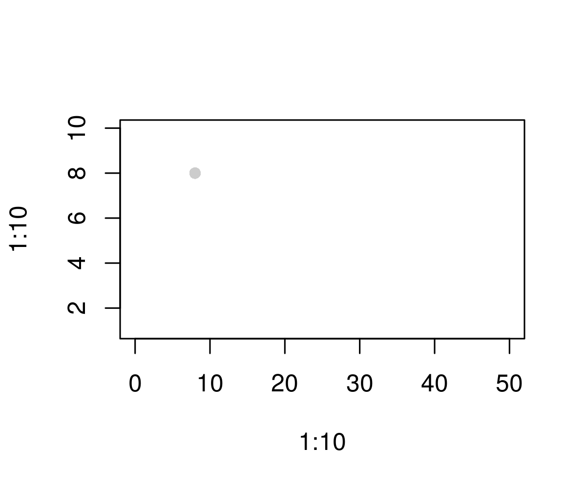

# opacShapes in R
This is a `R` package for drawing opac shapes.

# TODO list
| __to do__ | __status__
--- | --- | ---
| rescale shapes | `done`
| add different shapes | `in progress`

# point
## rescaled-version

The pdf version  and the PNG version is shown below.

```{r}
png('./figures/test.png',
    width=1200,height=1000,
    res=300)
plot(1:10,1:10,type='n',xlim=c(0,50))
source('./R/point.R')
point(x=8,y=8)
dev.off()
```

