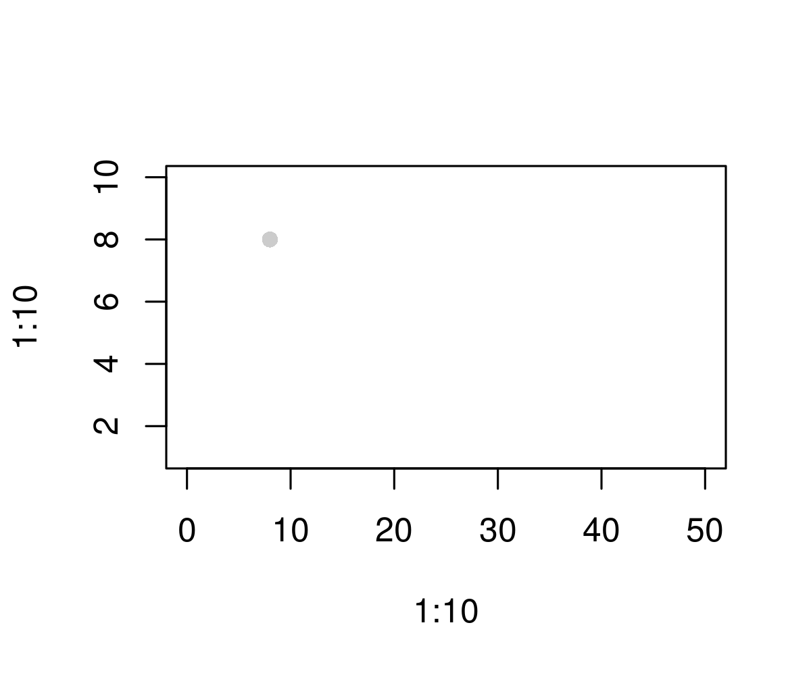

# opacShapes in R
This is a `R` package for drawing opac shapes.

# TODO list
| __to do__ | __status__
--- | --- | ---
| rescale shapes | `done`
| add different shapes | `in progress`

# point
## original version

## rescaled-version

