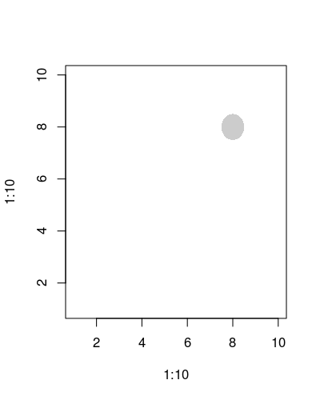

# opacShapes
Different shapes with opacity attributes
## point
### original version
- version 1 | 

```{r}
png('./vignettes/orgPoint1.png',
    width = 400,
    height = 500,
    res = 100)
plot(
    x = 1:10,
    y = 1:10,
    type='n',
    main = 'original version 1'
)
point(
    x = 8,
    y = 8,
    r = 5,
    scale = FALSE
    )
dev.off()

```
- version 2 | x-limit changed

```{r}
png('./vignettes/orgPoint2.png',
    width = 400,
    height = 500,
    res = 100)
plot(
    x = 1:10,
    y = 1:10,
    type = 'n',
    xlim = c(1,30),
    main = 'original version 2'
    )
point(
    x = 8,
    y = 8,
    r = 5,
    scale = FALSE)
dev.off()

```


### rescaled version



## circle

