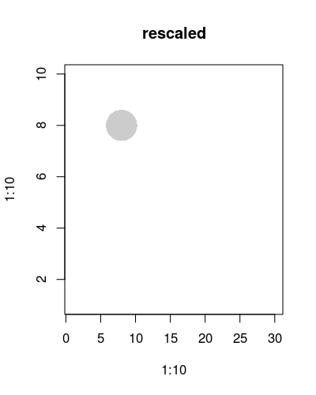

# opacShapes
Different shapes with opacity attributes
## point
### original version
- Without scaling x-axis and y-axis
- version 1 
```{r}
png('./vignettes/rescaledPoint1.png',
    width = 400,
    height = 500,
    res = 100)
plot(1:10,1:10,type='n')
point(
    x = 8,
    y = 8,
    r = 5,
    scale = FALSE)
dev.off()

```
- version 2 
```{r}
png('./vignettes/rescaledPoint2.png',
    width = 400,
    height = 500,
    res = 100)
plot(
    x = 1:10,
    y = 1:10,
    type = 'n',
    xlim = c(1,30)
    )
point(
    x = 8,
    y = 8,
    r = 5,
    scale = FALSE)
dev.off()

```


### rescaled version



## circle

