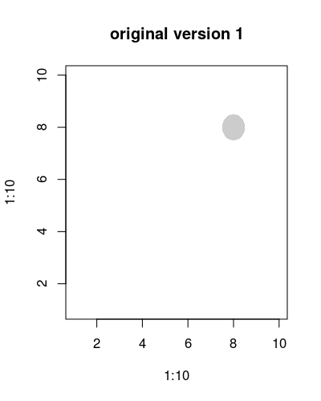
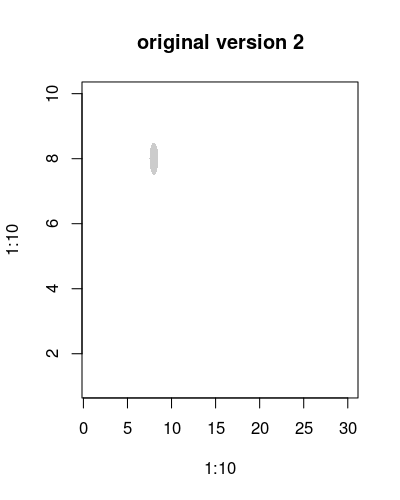
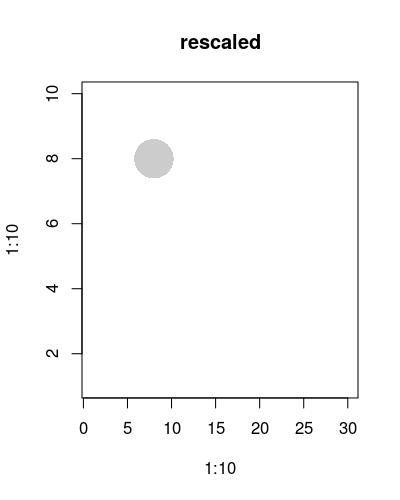
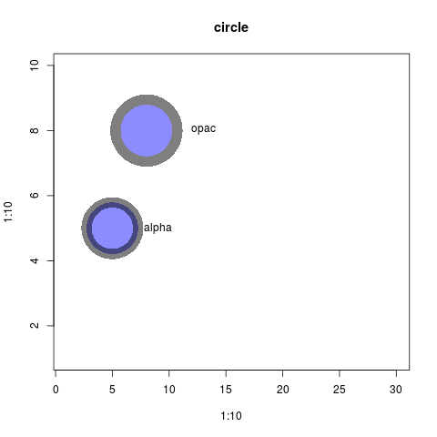
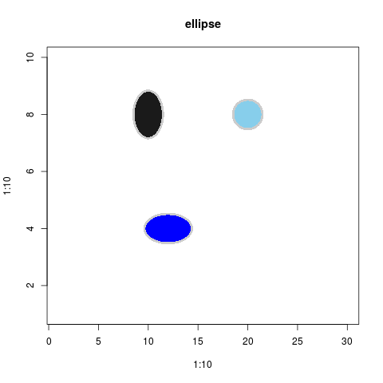
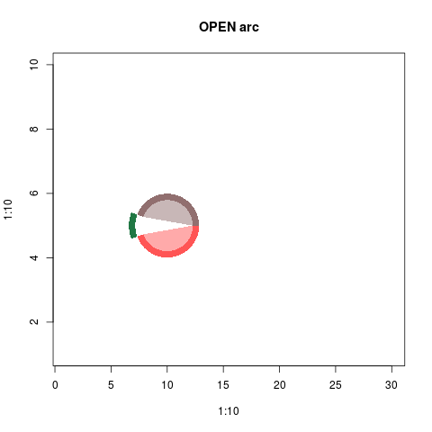

# opacShapes
Different shapes with opacity attributes
## point
### original version
- version 1 | 

```{r}
png('./vignettes/orgPoint1.png',
    width = 400,
    height = 500,
    res = 100)
plot(
    x = 1:10,
    y = 1:10,
    type='n',
    main = 'original version 1'
)
point(
    x = 8,
    y = 8,
    r = 5,
    scale = FALSE
    )
dev.off()

```
- version 2 | x-limit changed

```{r}
png('./vignettes/orgPoint2.png',
    width = 400,
    height = 500,
    res = 100)
plot(
    x = 1:10,
    y = 1:10,
    type = 'n',
    xlim = c(1,30),
    main = 'original version 2'
    )
point(
    x = 8,
    y = 8,
    r = 5,
    scale = FALSE)
dev.off()

```


### rescaled version


```{r}
png('./vignettes/scaledP.png',
    width = 400,
    height = 500,
    res = 100)
plot(
    x = 1:10,
    y = 1:10,
    type = 'n',
    xlim = c(1,30),
    main = 'rescaled'
    )
point(
    x = 8,
    y = 8,
    r = 5)
dev.off()

```

## circle

```{}
png('./vignettes/circle.png')
plot(
    x = 1:10,
    y = 1:10,
    type = 'n',
    xlim = c(1,30),
    main = 'circle'
    )
circle(
    x = 8,
    y = 8,
    r = 10,
    fill = rgb(0.1,0.1,1, alpha=0.5),
    stroke = rgb(0,0,0, alpha=0.5),
    stroke.size = 4,
    stroke.position  = 'out'
)
text(8+5,8,'opac')
circle(
    x = 5,
    y = 5,
    r = 10,
    fill = rgb(0.1,0.1,1, alpha=0.5),
    stroke = rgb(0,0,0, alpha=0.5),
    stroke.size = 4,
    stroke.position  = 'mid'
)
text(5+4,5,'alpha')
dev.off()
```

# ellipse

```{r}
png('./vignettes/ellipse.png')
plot(
    x = 1:10,
    y = 1:10,
    type = 'n',
    xlim = c(1,30),
    main = 'ellipse'
    )
ellipse(
    x = 20,
    y = 8,
    width = 6,
    height = 6,
    fill = 'skyblue',
    stroke = 'grey80'
)
ellipse(
    x = 10,
    y = 8,
    width = 6,
    height = 10,
    fill = 'grey10',
    stroke = 'grey80'
)

ellipse(
    x = 12,
    y = 4,
    width = 10,
    height = 6,
    fill = 'blue',
    stroke = 'grey80'
)
dev.off()
```

# arc
Different types of arc is adopted from [Processing](https://processing.org/reference/arc_.html)

## OPEN arc

```{r}
png('./vignettes/openArc.png')
plot(
    x = 1:10,
    y = 1:10,
    type = 'n',
    xlim = c(1,30),
    main = 'OPEN arc'
    )
strokes <- c(
    '#ff5555ff',
    '#916f6fff'
)
fills <- c(
    '#ffaaaaff',
    '#c8b7b7ff'
)
arc(
    x = 10,
    y = 5,
    s.angle = -160,
    e.angle = 0,
    stroke.size = 5,
    fill = fills[1],
    stroke = strokes[1]
)
arc(
    x = 10,
    y = 5,
    s.angle = 0,
    e.angle = 160,
    stroke.size = 5,
    fill = fills[2],
    stroke = strokes[2]
)
dev.off()

```
## CHORD arc

```{r}
```
## PIE arc
```{r}
```